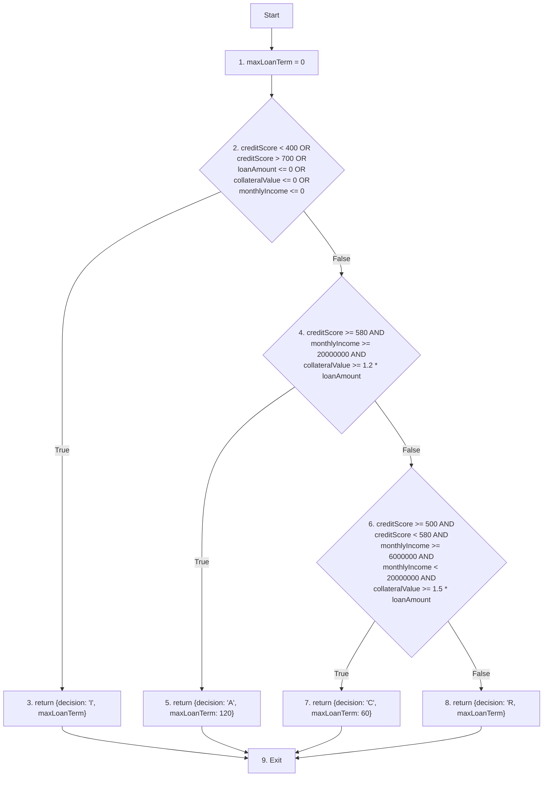

# C2 Coverage

- Path 1: 1 - 2(T) - 3 - 9\
  Test 1: makeDecision(300, 10000000, 12000000, 10000000)

- Path 2: 1 - 2(F) -4(T) - 5 - 9\
  Test 2: makeDecision(600, 10000000, 12000000, 21000000)

- Path 3: 1 - 2(F) - 4(F) - 6(T) - 7 - 9\
  Test 3: makeDecision(550, 10000000, 15000000, 8000000)

- Path 4: 1 - 2(F) - 4(F) - 6(F) - 8 - 9\
  Test 4: makeDecision(550, 10000000, 12000000, 10000000)

| Testcase                                        | Expected output                   | Actual output                     | Result |
| ----------------------------------------------- | --------------------------------- | --------------------------------- | ------ |
| makeDecision(300, 10000000, 12000000, 10000000) | {decision: 'I', maxLoanTerm: 0}   | {decision: 'I', maxLoanTerm: 0}   | Passed |
| makeDecision(600, 10000000, 12000000, 21000000) | {decision: 'A', maxLoanTerm: 120} | {decision: 'A', maxLoanTerm: 120} | Passed |
| makeDecision(550, 10000000, 15000000, 8000000)  | {decision: 'C', maxLoanTerm: 60}  | {decision: 'C', maxLoanTerm: 60}  | Passed |
| makeDecision(550, 10000000, 12000000, 10000000) | {decision: 'R, maxLoanTerm: 0}    | {decision: 'R, maxLoanTerm: 0}    | Passed |
